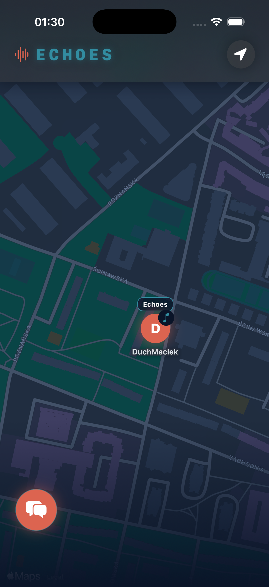
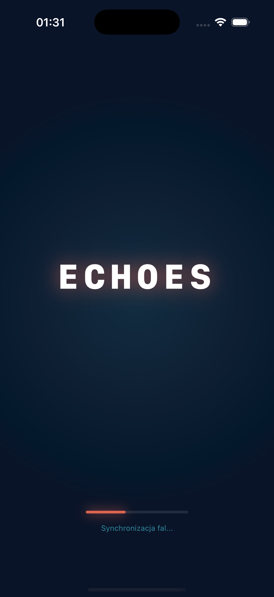

# 📡 ECHOES


**Echoes** is a hyper-local social experience that visualizes the "soundtrack of the city."
It allows users to discover what people nearby are listening to in real-time and engage in proximity-based chats.

> "Jak Cię widzą, tak Cię słyszą." (As you are seen, so you are heard.)

## 🎸 Inspiration & Concept

This project is a technical and artistic tribute to the song **"Echoes"** from Pink Floyd's 1971 album, *Meddle*. 

> *"Overhead the albatross hangs motionless upon the air / And deep beneath the rolling waves in labyrinths of coral caves / The echo of a distant time comes willowing across the sand"*

## 🌟 Key Features

* **📍 Real-time Presence:** Visualize nearby users on a dynamic map using `MapKit`.
* **🎵 Music Sync:** Automatically broadcasts your currently playing Apple Music track to users within range.
* **💬 Proximity Chat:** A geofenced chatroom (3km radius) powered by `Firestore`.
* **👻 Ghost Mode:** Automatic user clean-up after 10 minutes of inactivity to ensure map relevance.
* **🔒 Privacy First:** No historical location tracking. Data is transient.

## 🛠 Tech Stack

* **UI:** SwiftUI (ZStack architecture, complex animations).
* **Location:** CoreLocation (Background updates, precise geolocation).
* **Backend:** Firebase Firestore (Real-time listeners).
* **Music:** MediaPlayer / MusicKit integration.
* **Architecture:** MVVM (Model-View-ViewModel).

## 🚀 Installation & Setup

### Prerequisites
* Xcode 15+
* iOS 17.0+ Simulator or Device
* Apple Music Subscription (for full feature testing)

### Getting Started

1.  **Clone the repository:**
    ```bash
    git clone [https://github.com/Alexxy360/Echoes.git](https://github.com/Alexxy360/Echoes.git)
    cd Echoes
    ```

2.  **Firebase Configuration (Crucial):**
    > ⚠️ **Note:** The `GoogleService-Info.plist` file is excluded from this repository for security reasons.
    * Create a project in the [Firebase Console](https://console.firebase.google.com/).
    * Add an iOS app to the project.
    * Download your own `GoogleService-Info.plist`.
    * Drag and drop it into the `Echo/` folder in Xcode.

3.  **Build and Run:**
    * Open `Echoes.xcodeproj`.
    * Ensure all SPM packages (Firebase, etc.) are fetched.
    * Press `Cmd + R`.

## 📸 Screenshots

| Map View | Loading Screen |
|:---:|:---:|
| |  |


## 📜 License

This project is created for educational purposes.